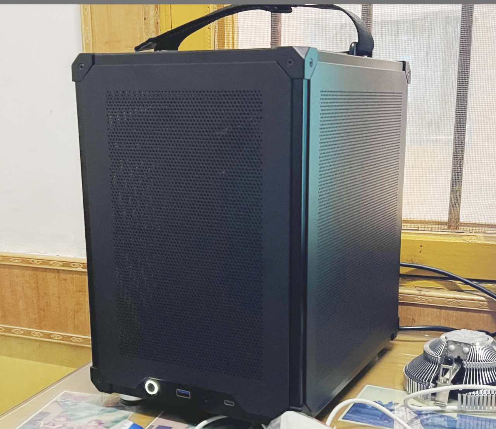

## JINGYUE X99M-PLUS D4 Hackintosh OpenCore EFI


### [简体中文](https://github.com/hackintosh-club/JINGYUE-X99M-PLUS-D4-OpenCore)

[OpenCore 1.0.3](https://github.com/acidanthera/OpenCorePkg)

### OS Version Tested

- macOS Monterey  12.x
- macOS Ventura     13.x
- macOS Sonoma    14.x
- macOS Sequoia    15.x

### Hardware

- Bios Version: 5.11
- CPU: Intel Xeon  E5-1650 v4
- RAM: SAMSUNG 16GB DDR4 2400Mhz RECC * 2
- SSD: Lexra  1TB Windows + MacOS
- GPU: COLORFUL AMD Radeon RX 5600XT 
- Audio: Realtek 
- WIFI: BCM943602CS + PCIE
- LAN: Realtek 
- PSU:  CoolerMaster  400W
- CASE:  JONSBO C6

### Notes

 - Use [OpenCore Configurator](https://mackie100projects.altervista.org/opencore-configurator/) or [OCAuxiliaryTools](https://github.com/ic005k/OCAuxiliaryTools) build your SMBIOS

### Bios Setup

```

   Advanced
    |-- ACPI Settings
	    |-- Enable ACPI Auto Configuration : Enabled
	         
	    |-- NCT5532D SSIO Configuration   
	         |-- Serial Port 1 Configration
	             |-- Serial Port : Disabled
	             
	    |-- CSM Configuration
	         |-- Video : UEFI
             |-- CSM Support : Disabled
           
        |-- USB Configuration
             |-- XHCI Hand-off : Enabled
             |-- EHCI Hand-off : Enabled
           
   IntelRCSetup
        |-- PCH Configuration
             |-- PCH SATA Configuration
                |-- SATA Controller : Enabled
                |-- Configure SATA as : AHCI
   Security
        |-- Secure Boot menu
             |-- Secure boot : Disabled
        
   Boot
        |-- Fast Boot : Disabled
        |-- Quiet Boot : Disabled
```

### Contact Us

QQ Group: 23304408


### CASE




### Tools

- [Hackintool](https://github.com/headkaze/Hackintool) 
- [OCAuxiliaryTools](https://github.com/ic005k/OCAuxiliaryTools) AKA `OCAT`.
- [OpenCore Configurator](https://mackie100projects.altervista.org/opencore-configurator/) AKA `OCC`.
- [gibMacOS](https://github.com/corpnewt/gibMacOS) Build your own MacOS image.
- [ProperTree](https://github.com/corpnewt/ProperTree) Plist editor.
