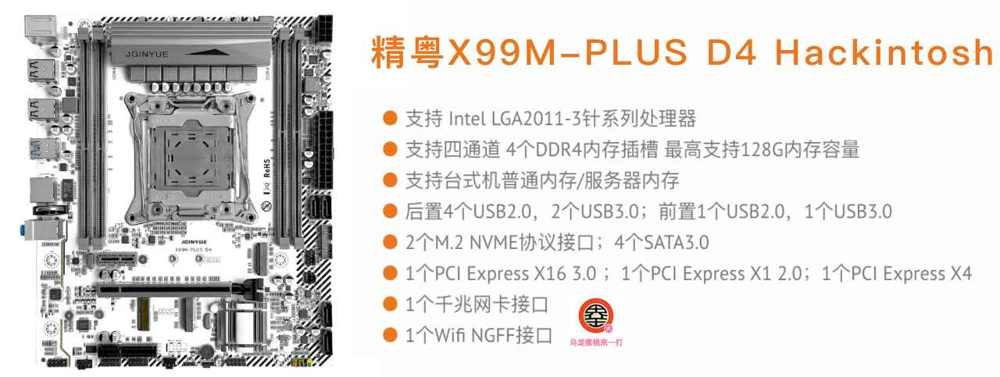
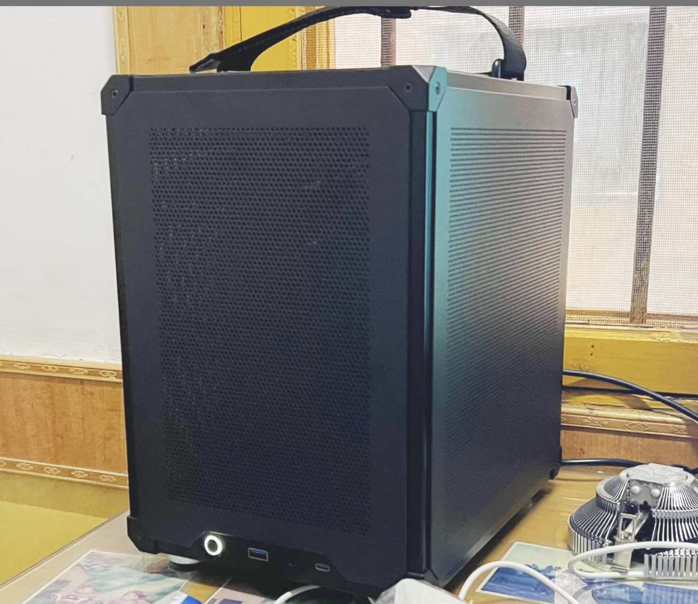

## 精粤X99M-PLUS D4  黑苹果 OpenCore EFI



### [ENGLISH](README.en.md)

[OpenCore 0.9.4](https://github.com/acidanthera/OpenCorePkg)

### macOS

- macOS Monterey 12.x
- macOS Ventura  13.x 

### 硬件

- Bios 版本: 5.11
- 处理器: 英特尔志强 E5-1650 v4
- 内存: 三星 16GB DDR4 2400Mhz RECC * 2
- 硬盘: 雷克沙 1TB Windows + MacOS
- 显卡: 七彩虹 AMD Radeon RX 5600XT 
- 声卡: 瑞昱 ALC
- 有线网卡:  瑞昱
- 无线网卡: BCM943602CS + PCIE转接卡
- 电源: 酷冷至尊 战斧2 400W
- 机箱: 乔思伯C6

### BIOS设置

```
  Advanced
        |-- ACPI Settings
	         |-- Enable ACPI Auto Configuration : Enabled
	         
	      |-- NCT5532D SSIO Configuration   
	         |-- Serial Port 1 Configration
	             |-- Serial Port : Disabled
	             
	      |-- CSM Configuration
	         |-- Video : UEFI
           |-- CSM Support : Disabled
           
        |-- USB Configuration
           |-- XHCI Hand-off : Enabled
           |-- EHCI Hand-off : Enabled
           
   IntelRCSetup
        |-- PCH Configuration
           |-- PCH SATA Configuration
                |-- SATA Controller : Enabled
                |-- Configure SATA as : AHCI
   Security
         |-- Secure Boot menu
           |-- Secure boot : Disabled
        
   Boot
         |-- Fast Boot : Disabled
         |-- Quiet Boot : Disabled
```

### 注意事项

 - 安装成功后必须使用 [OpenCore Configurator](https://mackie100projects.altervista.org/opencore-configurator/) 或者 [OCAuxiliaryTools](https://github.com/ic005k/OCAuxiliaryTools) 生成你自己的 SMBIOS


### 联系我们

QQ群: 23304408


### 机箱




### 常用工具

- [Hackintool](https://github.com/headkaze/Hackintool) 
- [OCAuxiliaryTools](https://github.com/ic005k/OCAuxiliaryTools) AKA `OCAT`.
- [OpenCore Configurator](https://mackie100projects.altervista.org/opencore-configurator/) AKA `OCC`.
- [gibMacOS](https://github.com/corpnewt/gibMacOS) Build your own MacOS image.
- [ProperTree](https://github.com/corpnewt/ProperTree) Plist editor.